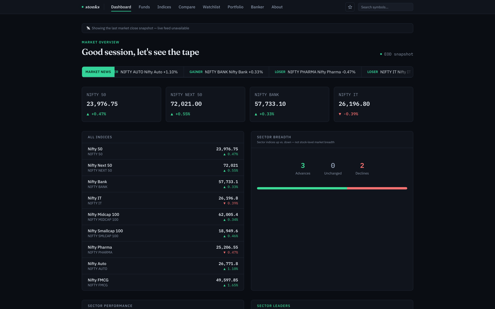
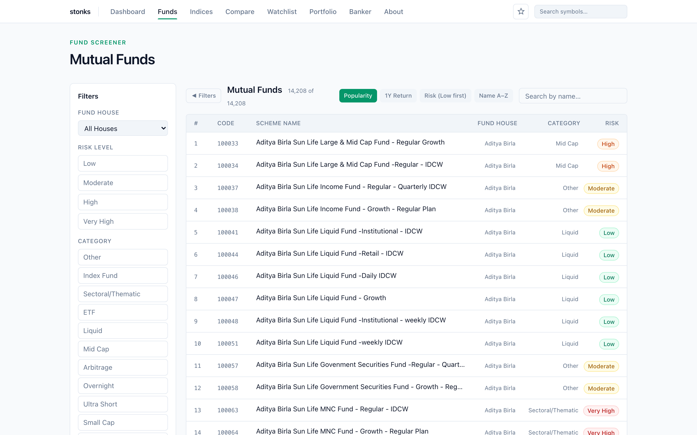
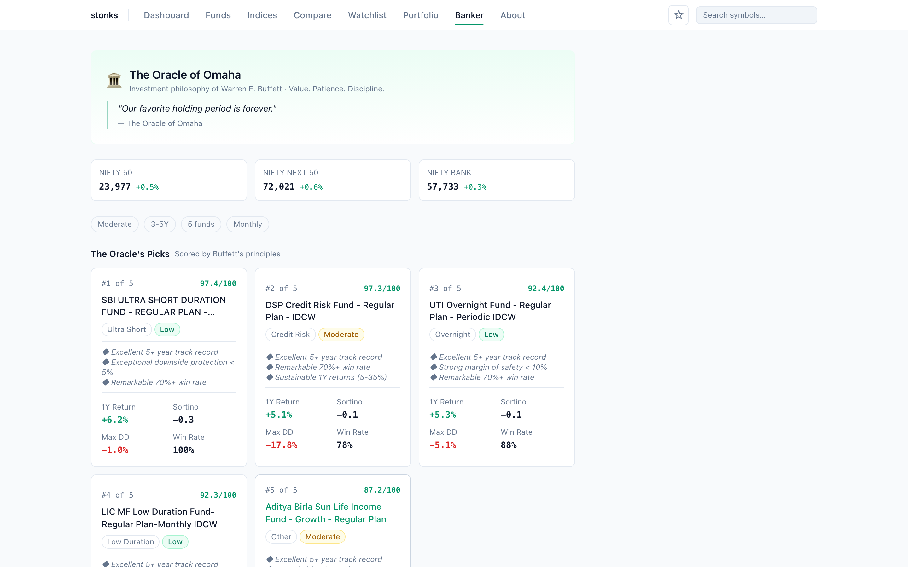

<div align="center">

# 📈 stonks

### A blazing-fast, keyless research terminal for the Indian markets

Screen **14,000+ mutual funds**, track **every NSE & BSE index** live, compare equities side-by-side, and get an algorithmic **Buffett-principles fund shortlist** — all in one quiet, data-dense terminal. No signup, no paywall, no API keys.

**[🚀 Live demo → francisreubenr-rvu.github.io/stonks](https://francisreubenr-rvu.github.io/stonks/)**


</div>

<div align="center">
  
</div>

---

## ✨ Features

| | Feature | What it does |
|---|---|---|
| 📊 | **Dashboard** | Live index cards (NIFTY 50, Bank, IT…), a real-time news ticker built from the day's actual movers, market-breadth advance/decline gauge, sector performance, and top gainers/losers. |
| 🔍 | **Fund Screener** | Filter 14,000+ AMFI-active mutual fund schemes by risk, category and fund house; live search + client-side sort (popularity, 1Y return, risk, name); paginated. |
| 📈 | **Fund Detail** | NAV history chart with selectable ranges, trailing CAGR (1M→inception), Sharpe / Sortino / annualised vol / max drawdown & recovery, monthly win-rate ring, calendar-year returns, and peer funds. |
| 🌐 | **Live Indices** | Every broad + sector index, drawn from the live NSE snapshot. |
| ⚖️ | **Compare** | Overlay up to 8 symbols side-by-side — price, change %, market cap, P/E, volume, exchange. |
| 🏢 | **Symbol Detail** | 30-day price chart plus fundamentals (P/E, P/B, EPS, ROE, D/E, dividend yield, sector, industry). |
| ⭐ | **Watchlist** | Track symbols with live quotes — persisted in your browser. |
| 💼 | **Portfolio** | Add holdings and see live P&L, day change, invested vs current value — persisted locally, never sent anywhere. |
| 🏛️ | **The Banker** | "Oracle of Omaha" — scores funds against Warren Buffett's investing principles based on your risk profile, horizon and diversification, with an **optional DeepSeek AI** portfolio critique. |

<div align="center">
  
  
</div>

---

## 🔌 Data — 100% real, zero mock

Every number on screen comes from a real source. There is no fabricated/placeholder data anywhere in the app.

| Source | Used for | Key required |
|---|---|---|
| **NSE India** (official public API, via CORS proxy) | Live index levels, equity quotes, EOD history | ❌ None |
| **MFAPI.in** | Mutual fund NAVs & full history | ❌ None |
| **AMFI** | Active scheme code manifest (prunes dead/defunct funds) | ❌ None |
| **DeepSeek** | *Optional* AI portfolio analysis on the Banker page | ⚠️ Optional |

- **Keyless by design.** The app ships with a small [Cloudflare Worker](api-proxy/worker.ts) that proxies NSE's public endpoints (handling cookies/CORS); in local dev, Vite's dev-server proxy does the same.
- **Resilient.** If a live feed is unavailable, the app falls back to real NSE close snapshots (`public/*-fallback.json`) refreshed by [`scripts/refresh-data.mjs`](scripts/refresh-data.mjs) — never to invented numbers.
- **Cached.** Fund lists and stats are cached in IndexedDB (`idb-keyval`) for instant repeat loads.

See [`docs/DATA_SOURCES.md`](docs/DATA_SOURCES.md) for the full data-flow breakdown.

---

## 🛠️ Tech Stack

- **Framework** — React 19 + TypeScript, [Vite 8](https://vite.dev)
- **Data layer** — [TanStack Query](https://tanstack.com/query) (caching, retries, background refetch) + `idb-keyval` persistence
- **Routing** — React Router 7 (`HashRouter`, GitHub-Pages friendly)
- **Styling** — Tailwind CSS v4 + a token-driven design system ([`DESIGN.md`](DESIGN.md)) — light-mode, data-dense, borders over shadows
- **UI** — Radix primitives, `lucide-react`, `class-variance-authority`, hand-built SVG/canvas charts (no chart lib)
- **Tooling** — [oxlint](https://oxc.rs), Playwright E2E ([`tests/e2e.py`](tests/e2e.py))
- **Proxy** — Cloudflare Worker (`wrangler`)
- **CI/CD** — GitHub Actions → GitHub Pages

---

## 🚀 Getting Started

```bash
# 1. Install
npm install

# 2. Run the dev server (Vite proxies NSE automatically)
npm run dev            # → http://localhost:5173

# 3. Build for production
npm run build          # tsc --noEmit && vite build → dist/
```

### Optional: DeepSeek AI analysis

The Banker page can run an AI portfolio critique. Provide a key either in the UI, or via an env file:

```bash
# .env.local
VITE_DEEPSEEK_KEY=sk-...
```

The key stays client-side and is only sent to DeepSeek when you click **Run AI Analysis**.

> **Warning:** Vite inlines every `VITE_`-prefixed variable into the built JS bundle — if you build and *publish* the app with `VITE_DEEPSEEK_KEY` set, the key is readable by every visitor. Use it for local dev only; on a shared deployment, enter the key in the UI instead (stored in your own browser's localStorage).

---

## 📜 Scripts

| Script | Description |
|---|---|
| `npm run dev` | Start Vite dev server with the NSE proxy |
| `npm run build` | Type-check (`tsc --noEmit`) and build to `dist/` |
| `npm run preview` | Serve the production build locally |
| `npm run lint` | Lint with oxlint |
| `npm run refresh-data` | Regenerate the real NSE fallback snapshots + landing ticker |
| `npm run deploy` | Refresh data, build, and publish to GitHub Pages |

Run the E2E suite (requires the dev server up):

```bash
python3 tests/e2e.py
```

---

## 🗂️ Project Structure

```
src/
  api/            NSE / MFAPI / AMFI / DeepSeek clients + fallback logic + types
  hooks/          useDashboard, useFundList, useFundDetail, useIndicesSnapshot,
                  useCompareSet, useSymbolDetail, useWatchlist, useBanker,
                  useScrollReveal, useCountUp (motion)
  lib/            banker scoring, Buffett principles, fund stats, caching, utils
  components/     IndexCard, DeltaBadge, RiskBadge, NewsTicker, NavChart, ui/…
  pages/          Landing, Dashboard, Funds, FundDetail, Indices, Compare,
                  SymbolDetail, Watchlist, Portfolio, Banker, About
  layouts/        RootLayout (nav + shell)
api-proxy/        Cloudflare Worker that proxies NSE's public API
scripts/          refresh-data.mjs — regenerates real fallback snapshots
docs/             DATA_SOURCES.md, screenshots
```

---

## 🚢 Deployment

Every push to `main` triggers [`.github/workflows/deploy.yml`](.github/workflows/deploy.yml): it builds the app and publishes `dist/` to GitHub Pages. The live site updates automatically within a few minutes.

---

## ⚠️ Disclaimer

**stonks** is a personal research tool. It is **not** affiliated with NSE, BSE, SEBI, AMFI, or any data vendor. Data may be delayed, incomplete, or inaccurate. Nothing here is financial advice, an investment recommendation, or an offer to buy or sell any security. Use at your own discretion.

---

<div align="center">

Built for the Indian markets · Personal research only

</div>
